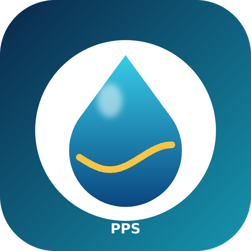

<p align="center">
  
</p>

<h1 align="center">Pool Pro Sync HA</h1>

<p align="center">
  <a href="https://github.com/hacs/integration"></a>
  <a href="LICENSE"></a>
  
</p>

A custom [HACS](https://hacs.xyz/) integration that exposes **PoolPro Sync**
pool controller data and controls in Home Assistant.

PoolPro Sync has no public/documented API — only a cloud-backed mobile app.
This project works by reverse-engineering that app's cloud API traffic (a
JetLinks-based IoT backend) and wrapping it in a standard Home Assistant
`custom_component`.

## Status

Working. Live telemetry and controls are confirmed functioning against a
real device:

**Sensors:** Water Temperature, Controller Temperature, Salt Level, Cell
Status, Chlorine Output, Fault Code

**Controls:** Power Mode (select), Work Mode (select), pH Pump (switch)

See [`API_NOTES.md`](API_NOTES.md) for the full reverse-engineered protocol,
[`CHANGELOG.md`](CHANGELOG.md) for release history, and
[`PLAN.md`](PLAN.md) for project background.

### Known limitations

- Confirmed working against a **SLIMLINE-series salt chlorinator**
  (`SL系列盐氯机`). Other PoolPro Sync product lines use the same protocol
  (it's a generic JetLinks device model) but haven't been tested — please
  open an issue if you try one and something doesn't work.
- Three properties the device's metadata advertises — Chlorine Production,
  Copper Level, Wi-Fi Signal — are not exposed as entities. Across dozens of
  captured sessions this unit's firmware never actually reports them, so
  they would only ever show `unknown`.
- The backend occasionally takes several seconds (or times out) to respond
  to a full-state refresh request. This is a device/gateway-side latency
  characteristic, not a bug in the integration — it retries automatically.

## Installation

1. Add this repository (`https://github.com/ryancscherer/PoolProSync-HA`) to
   HACS as a custom repository, category **Integration**.
2. Install "Pool Pro Sync HA" from HACS.
3. Restart Home Assistant.
4. Add the integration via Settings → Devices & Services → Add Integration →
   search for **"PoolPro Sync"**.
5. Enter your pool controller's **device ID** — a MAC-like string (e.g.
   `AABBCC112233`) found in the PoolPro Sync app's device details screen.
   There's no account login involved: the app uses a fixed backend
   credential, not a personal one, and your device model is detected
   automatically — nothing else to look up.

Treat your device ID like a password: PoolPro Sync's backend doesn't appear
to check that a device ID belongs to the account requesting it, so don't
post yours publicly (forum posts, screenshots, support tickets).

## Icon in Home Assistant's UI

HACS and the Settings → Devices & Services page don't read an icon from
this repository directly — they pull it from the community-maintained
[home-assistant/brands](https://github.com/home-assistant/brands)
repository. The `brands/` folder here holds the exact files/layout that
repo expects (`custom_integrations/poolpro_sync/icon.png` and
`icon@2x.png`); submitting them there via a PR is a separate, one-time
step still to be done. Until then, the integration works identically —
Home Assistant just shows a generic/missing-icon placeholder instead of
this one.

## Repo layout

```
custom_components/poolpro_sync/   # the Home Assistant integration
tests/                            # pytest suite
assets/                           # icon/logo used in this README
brands/                           # icon submission for home-assistant/brands
PLAN.md                           # project plan / roadmap
API_NOTES.md                      # reverse-engineered API documentation
CHANGELOG.md                      # release history
```

## Development

See [`PLAN.md`](PLAN.md) for the full build plan and milestones.

```bash
python -m venv .venv
source .venv/bin/activate
pip install -r requirements_test.txt
pytest
```

## Contributing

Issues and pull requests are welcome. If you're debugging a protocol
question, `API_NOTES.md` documents everything confirmed about the API so
far — please add to it rather than duplicating captures. If you have a
different PoolPro Sync product line, a packet capture (HAR file, with TLS
decryption if possible) showing its device-detail response and WebSocket
property reports would help extend support.

## Disclaimer

This is an unofficial, community integration. It is not affiliated with or
endorsed by PoolPro Sync. It relies on an undocumented API that may change
without notice. The icon/logo in this repository is an original design
inspired by, but distinct from, PoolPro Sync's own branding.

## License

[MIT](LICENSE)
